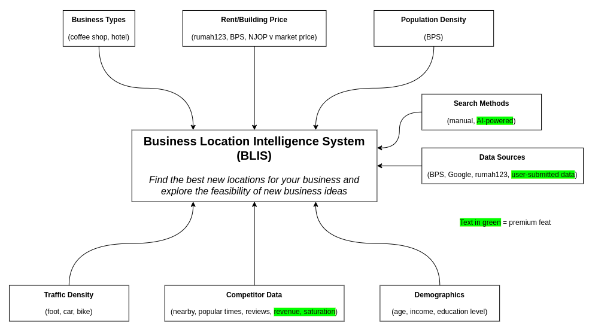

# Business Location Intelligence System (BLIS)

## The Idea



## Functions
- Find the best new locations for your business
- Explore new business ideas

## Docs

[https://monogr.ph/66e6eabc06f4f7fdf7da514d](https://monogr.ph/66e6eabc06f4f7fdf7da514d)

## Tech Stack

- Astro
- ShadCN UI (React, Tailwind, Typescript)

## Commands

All commands are run from the root of the project, from a terminal:

| Command                   | Action                                           |
| :------------------------ | :----------------------------------------------- |
| `npm install`             | Installs dependencies                            |
| `npm run dev`             | Starts local dev server at `localhost:4321`      |
| `npm run build`           | Build your production site to `./dist/`          |
| `npm run preview`         | Preview your build locally, before deploying     |
| `npm run astro ...`       | Run CLI commands like `astro add`, `astro check` |
| `npm run astro -- --help` | Get help using the Astro CLI                     |

# Project Structure
```
(base) $ tree -L 4 --prune -I 'node_modules'
.
├── astro.config.mjs
├── components.json
├── LICENSE
├── package.json
├── package-lock.json
├── public
│   ├── favicon.svg
│   └── images
│       └── blis-diagram.png
├── README.md
├── src
│   ├── components
│   │   ├── dashboard.tsx
│   │   ├── feedback-form.tsx
│   │   ├── login-form.tsx
│   │   └── ui
│   │       ├── badge.tsx
│   │       ├── button.tsx
│   │       ├── card.tsx
│   │       ├── drawer.tsx
│   │       ├── input.tsx
│   │       ├── label.tsx
│   │       ├── select.tsx
│   │       ├── slider.tsx
│   │       ├── textarea.tsx
│   │       └── tooltip.tsx
│   ├── env.d.ts
│   ├── layouts
│   │   └── Layout.astro
│   ├── lib
│   │   └── utils.ts
│   ├── pages
│   │   ├── api
│   │   │   ├── feedback.ts
│   │   │   └── login.ts
│   │   ├── dashboard.astro
│   │   ├── index.astro
│   │   └── login.astro
│   └── styles
│       └── globals.css
├── tailwind.config.mjs
└── tsconfig.json

11 directories, 32 files
```
